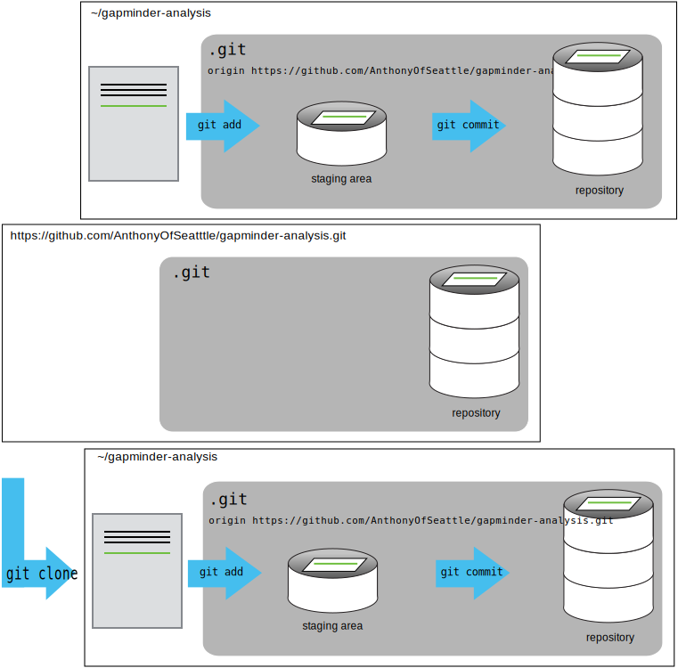

For the next step, get into pairs.  One person will be the "Owner" and the other
will be the "Collaborator". The goal is that the Collaborator add changes into
the Owner's repository. We will switch roles at the end, so both persons will
play Owner and Collaborator.

> ## Practicing By Yourself
>
> If you're working through this lesson on your own, you can carry on by opening
> a second terminal window.
> This window will represent your partner, working on another computer. You
> won't need to give anyone access on GitHub, because both 'partners' are you.
{: .callout}

The Owner needs to give the Collaborator access.
On GitHub, click the settings button on the right,
then select Collaborators, and enter your partner's username.


To accept access to the Owner's repo, the Collaborator
needs to go to [https://github.com/notifications](https://github.com/notifications).
Once there she can accept access to the Owner's repo.

Next, the Collaborator needs to download a copy of the Owner's repository to her
 machine. This is called "cloning a repo". To clone the Owner's repo into
her `Desktop` folder, the Collaborator enters:

~~~
$ git clone https://github.com/AnthonyOfSeattle/gapminder-analysis.git gapminder-analysis-colab
~~~
{: .language-bash}

Replace 'AnthonyOfSeattle' with the Owner's username.



The Collaborator can now make a change in their clone of the Owner's repository,
exactly the same way as we've been doing before:

~~~
$ cd gapminder-analysis-colab
$ nano README.md
$ cat README.md
~~~
{: .language-bash}

~~~
--- a/README.md
+++ b/README.md
@@ -1,6 +1,6 @@
 # Gapminder Analysis
 
-**Author:** Anthony Valente
+**Authors:** Anthony Valente, Daniel McCloy
 **Depends:** ggplot2, dplyr
 **Start Date:** 2020-01-28

~~~
{: .output}

~~~
$ git add README.md
$ git commit -m "Add coauthor"
~~~
{: .language-bash}

~~~
[master 4b45f39] Add coauthor
 1 file changed, 1 insertion(+), 1 deletion(-)
~~~
{: .output}

Then push the change to the *Owner's repository* on GitHub:

~~~
$ git push origin master
~~~
{: .language-bash}

~~~
Counting objects: 3, done.
Delta compression using up to 4 threads.
Compressing objects: 100% (3/3), done.
Writing objects: 100% (3/3), 301 bytes | 301.00 KiB/s, done.
Total 3 (delta 2), reused 0 (delta 0)
remote: Resolving deltas: 100% (2/2), completed with 2 local objects.
To https://github.com/AnthonyOfSeattle/gapminder-analysis.git
   4bfb2ab..4b45f39  master -> master
~~~
{: .output}

Note that we didn't have to create a remote called `origin`: Git uses this
name by default when we clone a repository.  (This is why `origin` was a
sensible choice earlier when we were setting up remotes by hand.)

> ## Some more about remotes
>
> In this episode and the previous one, our local repository has had
> a single "remote", called `origin`. A remote is a copy of the repository
> that is hosted somewhere else, that we can push to and pull from, and 
> there's no reason that you have to work with only one. For example, 
> on some large projects you might have your own copy in your own GitHub
> account (you'd probably call this `origin`) and also the main "upstream"
> project repository (let's call this `upstream` for the sake of examples).
> You would pull from `upstream` from time to 
> time to get the latest updates that other people have committed.
>
> Remember that the name you give to a remote only exists locally. It's
> an alias that you choose - whether `origin`, or `upstream`, or `fred` -
> and not something intrinstic to the remote repository.
>
> The `git remote` family of commands is used to set up and alter the remotes
> associated with a repository. Here are some of the most useful ones:
>
> * `git remote -v` lists all the remotes that are configured (we already used
> this in the last episode)
> * `git remote add [name] [url]` is used to add a new remote
> * `git remote remove [name]` removes a remote. Note that it doesn't affect the 
> remote repository at all - it just removes the link to it from the local repo.
> * `git remote set-url [name] [newurl]` changes the URL that is associated 
> with the remote. This is useful if it has moved, e.g. to a different GitHub
> account, or from GitHub to a different hosting service. Or, if we made a typo when
> adding it!
> * `git remote rename [oldname] [newname]` changes the local alias by which a remote 
> is known - its name. For example, one could use this to change `upstream` to `fred`.
{: .callout}

Take a look to the Owner's repository on its GitHub website now (maybe you need
to refresh your browser.) You should be able to see the new commit made by the
Collaborator.

To download the Collaborator's changes from GitHub, the Owner now enters:

~~~
$ git pull origin master
~~~
{: .language-bash}

~~~
remote: Enumerating objects: 5, done.
remote: Counting objects: 100% (5/5), done.
remote: Compressing objects: 100% (1/1), done.
remote: Total 3 (delta 2), reused 3 (delta 2), pack-reused 0
Unpacking objects: 100% (3/3), done.
From https://github.com/AnthonyOfSeattle/gapminder-analysis
 * branch            master     -> FETCH_HEAD
   4bfb2ab..4b45f39  master     -> origin/master
Updating 4bfb2ab..4b45f39
Fast-forward
 README.md | 2 +-
 1 file changed, 1 insertion(+), 1 deletion(-)
~~~
{: .output}

Now the three repositories (Owner's local, Collaborator's local, and Owner's on
GitHub) are back in sync.

> ## A Basic Collaborative Workflow
>
> In practice, it is good to be sure that you have an updated version of the
> repository you are collaborating on, so you should `git pull` before making
> our changes. The basic collaborative workflow would be:
>
> * update your local repo with `git pull origin master`,
> * make your changes and stage them with `git add`,
> * commit your changes with `git commit -m`, and
> * upload the changes to GitHub with `git push origin master`
>
> It is better to make many commits with smaller changes rather than
> of one commit with massive changes: small commits are easier to
> read and review.
{: .callout}

> ## Switch Roles and Repeat
>
> Switch roles and repeat the whole process.
{: .challenge}

> ## Review Changes
>
> The Owner pushed commits to the repository without giving any information
> to the Collaborator. How can the Collaborator find out what has changed with
> command line? And on GitHub?
>
> > ## Solution
> > On the command line, the Collaborator can use ```git fetch origin master```
> > to get the remote changes into the local repository, but without merging
> > them. Then by running ```git diff master origin/master``` the Collaborator
> > will see the changes output in the terminal.
> >
> > On GitHub, the Collaborator can go to the repository and click on 
> > "commits" to view the most recent commits pushed to the repository.
> {: .solution}
{: .challenge}

> ## Comment Changes in GitHub
>
> The Collaborator has some questions about one line change made by the Owner and
> has some suggestions to propose.
>
> With GitHub, it is possible to comment the diff of a commit. Over the line of
> code to comment, a blue comment icon appears to open a comment window.
>
> The Collaborator posts its comments and suggestions using GitHub interface.
{: .challenge}

> ## Version History, Backup, and Version Control
>
> Some backup software can keep a history of the versions of your files. They also
> allows you to recover specific versions. How is this functionality different from version control?
> What are some of the benefits of using version control, Git and GitHub?
{: .challenge}
